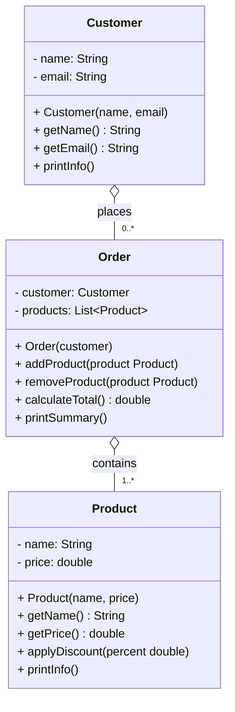
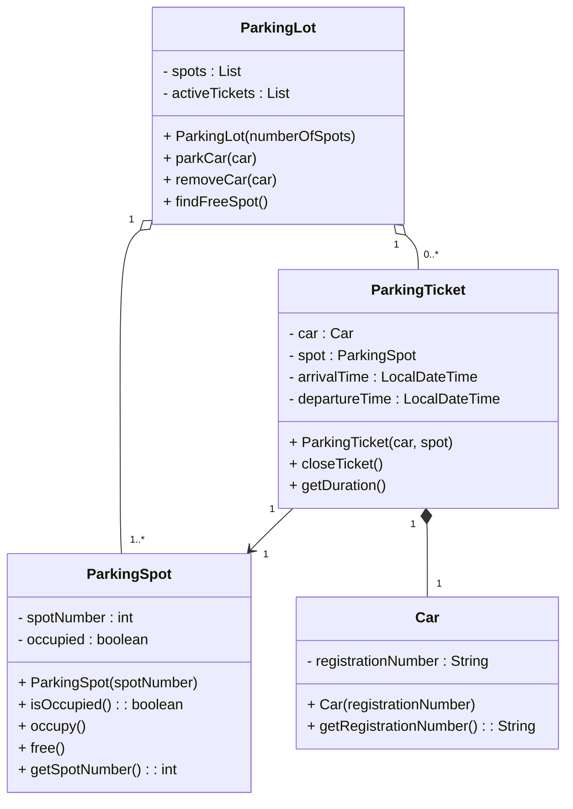
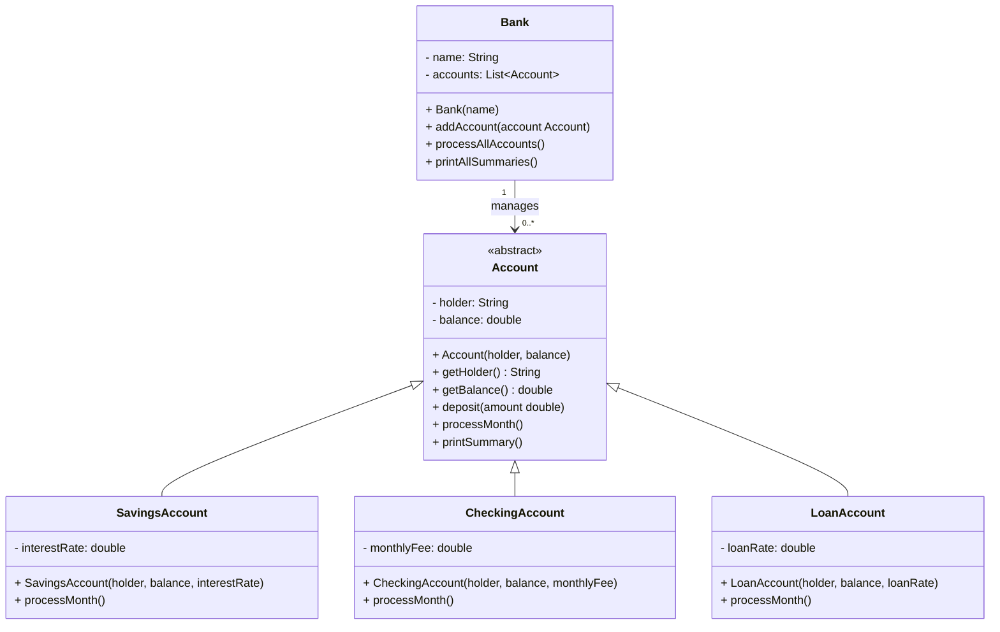
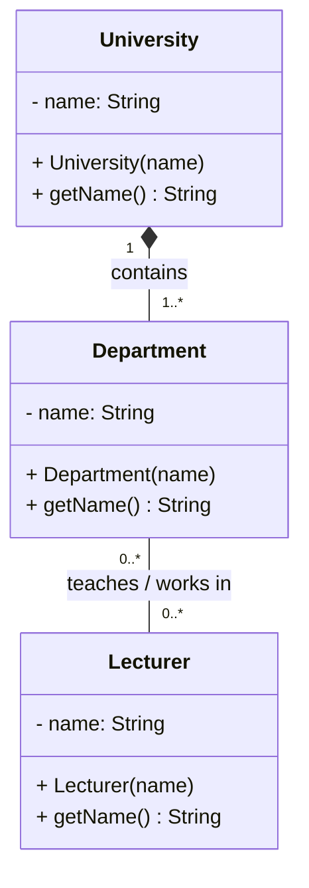
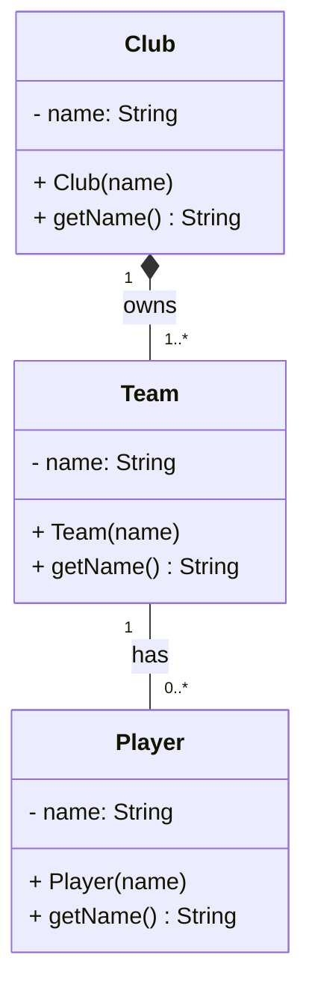
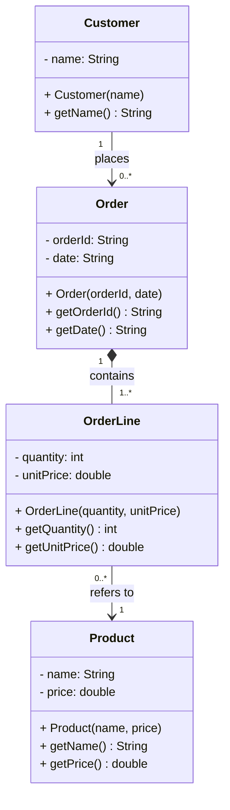

# OOP

## Exercise 1 — Online Shop

A small online shop lets customers browse a product catalog and place orders. Each order belongs to one customer and can contain multiple products. The shop needs to track what was ordered, by whom, and what the total cost is.

You will implement this system as one app with three classes: `Customer`, `Product`, and `Order`.

### Class Diagram

Study this diagram before you start writing any code. Understand what each class holds, what it can do, and how the classes connect.

**Relationship type:** Both are **aggregation** — products exist in the catalog before and after any order; orders exist independently of the session that created them. A customer can place zero or more orders (`1` to `0..*`), and an order must contain at least one product (`1` to `1..*`).

### Implementation

Build the three classes based on the diagram above.

**`Product`**
- Constructor: reject a blank name or a negative price
- `applyDiscount(double percent)` — reduces the price by that percentage; reject a discount above 80%
- `printInfo()` — prints the product name and current price

**`Customer`**
- Constructor: reject a blank name or a blank email
- `printInfo()` — prints the customer's name and email

**`Order`**
- Created with a `Customer` — the customer cannot change after the order is placed
- `addProduct` / `removeProduct` — update the internal list
- `calculateTotal()` — returns the sum of all product prices
- `printSummary()` — prints the customer's name, each product, and the total

### Demonstrate in `App`

Run the following flow and show the output:

1. Create two products — apply a discount to one
2. Create a customer
3. Place an order for that customer — add both products
4. Print the order summary
5. Remove one product and print the summary again to show the total updated

---

## Exercise 2 (Optional) — The Parking Lot

*Design the classes yourself. There is no class diagram given — read the scenario, decide what exists, how things connect, and build it. Draw your own class diagram when you are done.*

---

A parking lot in central Stockholm wants to replace its paper log with a digital system.

When a car arrives, the attendant finds a free spot, assigns the car to it, and creates a ticket. The ticket records the spot number and the time the car arrived. When the car leaves, the ticket is closed and the system prints how long the car was parked. The ticket belongs to that session — it has no meaning without it.

The parking lot holds a fixed number of spots. Each spot is either free or occupied. The attendant does not own the spots — they interact with whichever one is needed at that moment.

### What the system must do

- Track which spots are free and which are occupied
- When a car arrives: find a free spot, mark it occupied, create a ticket with the spot number and arrival time
- When a car leaves: close the ticket, print the duration, and free the spot
- If no spots are available when a car arrives: print a message instead of assigning a spot

### Demonstrate in `App`

Run this flow and show the output:

1. Set up a parking lot with 3 spots
2. Three cars arrive one by one — each is assigned a spot
3. A fourth car arrives — no free spots, print the message
4. The first car leaves — print the duration and free its spot
5. The fourth car arrives again — it now gets the freed spot

> **Think:** who creates the ticket — the spot, the attendant, or the parking lot? Your answer determines the relationship type. Be ready to defend it.

Draw a class diagram for your solution — classes, fields, methods, relationship arrows, and multiplicity.

* ParkingLot → ParkingSpot = Aggregation
    - Spots exist as part of the lot.
    - The lot manages them.
* ParkingLot → ParkingTicket = Aggregation
    - The lot creates and stores active tickets.
* ParkingTicket → Car
    - Every ticket belongs to exactly one car.
* ParkingTicket → ParkingSpot
    - Every ticket records one parking spot.
---

# OOP

## Exercise 1 — The Bank

A bank manages three types of accounts: savings, checking, and loan. Every account has a holder name and a balance. But what happens at the end of each month is different — a savings account earns interest, a checking account is charged a monthly fee, and a loan account accumulates interest debt. The bank processes all accounts at month-end without caring which type each one is.

You will implement this system as one app with five classes: `Account`, `SavingsAccount`, `CheckingAccount`, `LoanAccount`, and `Bank`.

### Class Diagram

Study this diagram before you write any code. `Account` is `<<abstract>>` — a customer always opens a specific type of account, never a plain one.

**Relationship types:** `<|--` is inheritance — all three account types share `holder` and `balance` from `Account`. `Bank --> Account` is aggregation — accounts exist independently of the bank object. `processMonth()` is declared `abstract` in `Account` — every subclass applies its own month-end rule.

### Implementation

**`Account`** (abstract)
- Constructor: reject a blank holder name or a negative balance
- `deposit(double amount)` — concrete; adds to balance, reject a negative amount
- `processMonth()` — declare as `abstract`; no body
- `printSummary()` — concrete; prints: `[holder] | Balance: [balance] kr`

**`SavingsAccount`**
- Constructor: call `super(holder, balance)`, store `interestRate`
- `processMonth()` — adds `balance * interestRate` to balance; prints: `[holder]: interest credited`

**`CheckingAccount`**
- Constructor: call `super(holder, balance)`, store `monthlyFee`
- `processMonth()` — deducts `monthlyFee` from balance; prints: `[holder]: monthly fee charged`

**`LoanAccount`**
- Constructor: call `super(holder, balance)`, store `loanRate`
- `processMonth()` — adds `balance * loanRate` to balance (debt grows); prints: `[holder]: loan interest added`

**`Bank`**
- `processAllAccounts()` — calls `processMonth()` on every account
- `printAllSummaries()` — calls `printSummary()` on every account

### Demonstrate in `App`

1. Create a bank named `"Lexicon Bank"`
2. Add a savings account (`1000 kr`, `2% rate`), a checking account (`500 kr`, `25 kr fee`), and a loan account (`5000 kr`, `3% rate`)
3. Call `printAllSummaries()` — print the starting balances
4. Call `processAllAccounts()` — each account applies its own month-end rule
5. Call `printAllSummaries()` again — show the updated balances

> **Think:** `processAllAccounts()` calls `processMonth()` on every account using a `List<Account>` — it never checks the type. How does Java know which version of `processMonth()` to run for each account? Why can you not write `new Account("Ali", 1000)`?

---

## Exercise 2 — University Departments

A university is made up of several departments — Computer Science, Business, and Design. Each department belongs to one university. If the university closes, its departments cease to exist with it.

Each department has a number of lecturers. A lecturer can teach across more than one department and may move between departments at the end of the year. If a department is dissolved, its lecturers do not disappear — they can be reassigned elsewhere in the university.

What is the relationship between `University` and `Department`? What is the relationship between `Department` and `Lecturer`? Draw a class diagram with the correct arrow types and multiplicity on both ends.

---

## Exercise 3 — Sports Club

A football club runs three teams: a first team, a reserve team, and a youth team. Each team belongs to the club — the First Team of Malmö FF has no meaning outside of Malmö FF. If the club shuts down, its teams cease to exist.

Players are assigned to a team. A player can be transferred to another club or loaned to a different team. If a team is disbanded, the players still exist — they remain registered with the club and can be reassigned.

What is the relationship between `Club` and `Team`? What is the relationship between `Team` and `Player`? Draw a class diagram with the correct arrow types and multiplicity on both ends.

---

## Exercise 4 — Customer Orders

When a customer places an order in an online shop, the order is made up of order lines — one line per product, recording what was ordered and how many units. If the order is cancelled and deleted, its order lines have no meaning and are removed with it.

The products in the catalog exist on their own. They were there before any order was placed and remain after orders are completed or cancelled.

What is the relationship between `Order` and `OrderLine`? What is the relationship between `OrderLine` and `Product`? What is the relationship between `Customer` and `Order`? Draw a class diagram with the correct arrow types and multiplicity on both ends.

---

